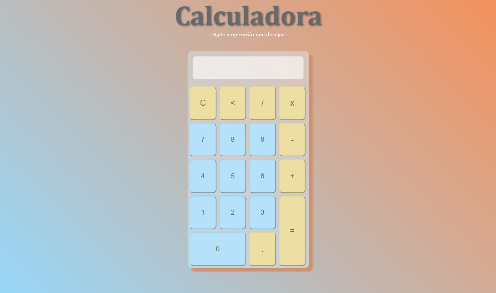

# 🧲Calculadora - JavaScript🧲

## 🕹️ Índice 

* [Calculadora - JavaScript](#Título-e-Imagem-de-capa)
* [Badges](#badges)
* [Índice](#índice)
* [Descrição do Projeto](#descrição-do-projeto)
* [Status do Projeto](#status-do-Projeto)
* [Funcionalidades e Demonstração da Aplicação](#funcionalidades-e-demonstração-da-aplicação)
* [Acesso ao Projeto](#acesso-ao-projeto)
* [Tecnologias utilizadas](#tecnologias-utilizadas)
* [Licença](#licença)

## 🔴 Descrição do Projeto

> Inspirações, Apps e Estudos utilizados:
* [Emojipedia](https://emojipedia.org/)
* [CSS Gradient](https://cssgradient.io/)
* [Favicon.cc](https://www.favicon.cc/)

##  🔴 Status do Projeto
 
:construction:  Projeto concluído em Setembro de 2022  :construction:

## :hammer: Funcionalidades do projeto

- `Funcionalidade 1`: Calculadora com todas as operações.

## 🔴 Acesso ao projeto

Você pode acessar o código na pasta [Código](https://github.com/Clousbi/Calculadora-JS/tree/main/c%C3%B3digo). 

## :white_check_mark: Tecnologias Utilizadas
* HTML5;
* CSS3;
* JavaScript;

## Licença
Calculadora-JS é licenciado pelo [MIT](https://github.com/Clousbi/Calculadora-JS/blob/main/LICENSE). 
>
A documentação do LPM (por exemplo, arquivos .md na pasta ./docs) também é licenciada pelo MIT.